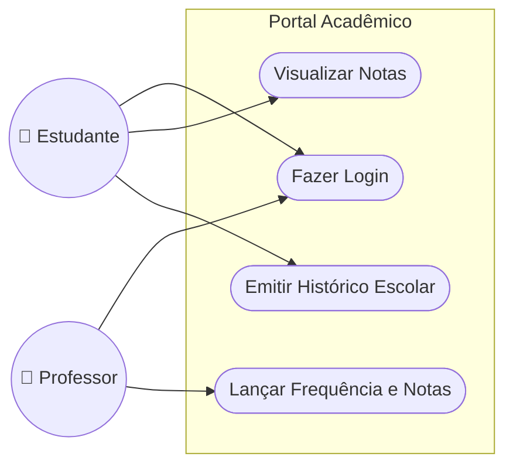

```mermaid
flowchart LR
    %% Atores
    Aluno(("👤 Estudante"))
    Prof(("👤 Professor"))

    %% Sistema (Fronteira)
    subgraph Portal ["Portal Acadêmico"]
        UC1(["Fazer Login"])
        UC2(["Visualizar Notas"])
        UC3(["Lançar Frequência e Notas"])
        UC4(["Emitir Histórico Escolar"])
    end

    %% Conexões do Estudante
    Aluno --> UC1
    Aluno --> UC2
    Aluno --> UC4

    %% Conexões do Professor
    Prof --> UC1
    Prof --> UC3
```

<!--

actor: Define o papel do usuário.

package: Agrupa as funcionalidades do sistema.

usecase: Representa a ação do sistema.

- ->: Conecta o ator à ação.

-->